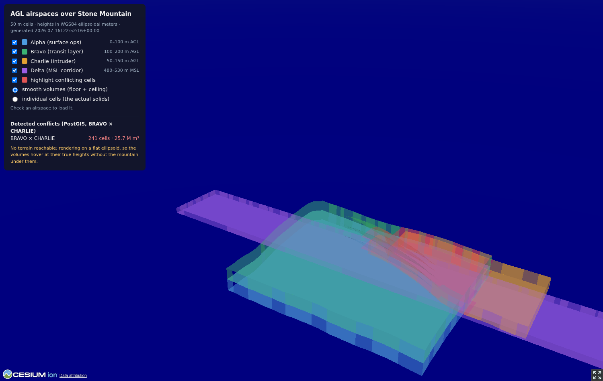
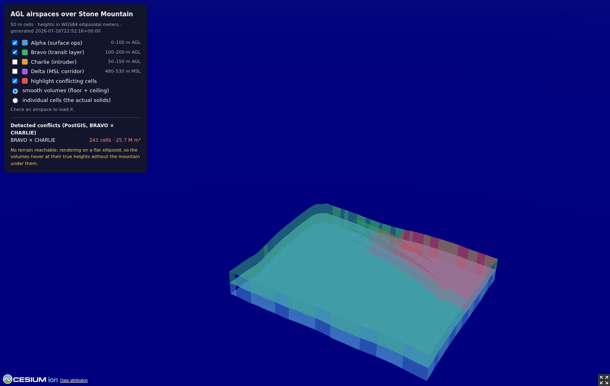
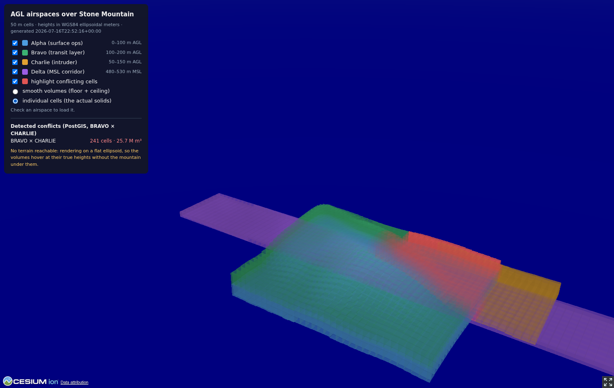

# Terrain-Following Airspace Volumes with PostGIS Tessellation

How practical is it to model **above-ground-level (AGL) airspace volumes** as
true 3D solids in PostGIS — accurately following real terrain — and to detect
overlaps between them in the database? This demo builds the whole pipeline and
measures it: real elevation data over **Stone Mountain, GA**, tessellated
terrain-following volumes built entirely in SQL, 3D conflict detection three
different ways, and a CesiumJS viewer that renders the result on real
satellite terrain.

> **Deep dive:** [HOW_IT_WORKS.md](HOW_IT_WORKS.md) explains the whole
> approach end to end — including why the common "sample terrain once at the
> polygon centroid" model produces false negatives on real conflicts and
> volumes that extend underground, and how to migrate such a system to
> tessellated terrain-following volumes.



*Four airspaces over Stone Mountain at 50 m tessellation, in the viewer's
smooth-volume mode. Red is the conflict detected by PostGIS between BRAVO and
CHARLIE. (Screenshots captured without terrain reachable, so the mountain
itself isn't rendered — the volumes still sit at their true heights, and you
can see the dome's shape pressed into them.)*

## The problem

Airspace for low-altitude operations (drones, helicopters, obstacle clearance)
is usually defined **relative to the ground**: "0 to 100 meters AGL over this
polygon." That's trivial to write down and impossible to store directly as
geometry, because the floor and ceiling of that volume are *curved surfaces* —
they undulate with every bump in the terrain below. A database can't index "a
polygon plus the phrase 'above ground level'".

The standard trick — and the thing this demo evaluates — is **tessellation**:

1. Split the airspace footprint into small grid cells.
2. Sample the terrain elevation under each cell.
3. Turn each cell into a flat-bottomed 3D prism: floor = ground + lower AGL
   bound, ceiling = ground + upper AGL bound.
4. The union of prisms approximates the true terrain-following volume, and
   the approximation error shrinks with cell size.

Each prism is an honest, closed 3D solid that PostGIS (via
[SFCGAL](https://sfcgal.gitlab.io/SFCGAL/)) can index, intersect, and measure.

## The scenario

Four airspaces over Stone Mountain — an isolated granite dome rising ~250 m
out of flat terrain east of Atlanta (summit ≈ 514 m MSL). Real WGS84
coordinates, real elevation data:

| id | vertical bounds | footprint | purpose |
|---|---|---|---|
| **ALPHA** | 0–100 m **AGL** | 1.6 × 0.9 km over the dome | surface operations layer |
| **BRAVO** | 100–200 m **AGL** | same footprint as ALPHA | transit layer stacked directly on ALPHA |
| **CHARLIE** | 50–150 m **AGL** | offset NE, overlapping ALPHA/BRAVO | deliberate intruder |
| **DELTA** | 480–530 m **MSL** | E–W corridor across the dome | fixed-altitude corridor |

ALPHA and BRAVO are the key test: they're defined back-to-back (one's ceiling
is the other's floor, everywhere), so a correct system must render them
flush — both deforming over the mountain — and report **zero** overlap between
them:



*ALPHA and BRAVO only: flush stacked surfaces with zero shared volume (the
red patch is BRAVO's conflict with the hidden CHARLIE, not with ALPHA). The
"individual cells" render mode shows the underlying prisms instead:*



DELTA is the bonus case that shows why real 3D matters: it's a *fixed*
altitude band, so whether it conflicts with the AGL volumes depends entirely
on the terrain. Over the flats it slices through BRAVO's band; near the summit
it drops below into ALPHA; its floor even clamps to the mountain where the
ground rises into the corridor. No 2D footprint comparison could tell you any
of that.

## Heights: the part everyone gets wrong

Three different "altitudes" appear in this pipeline, and mixing them up puts
your volumes 30 meters underground:

- **AGL** — height above the local ground. A *relative* measure; needs a
  terrain model to resolve.
- **MSL / orthometric** — height above the geoid (what DEMs and aviation
  charts use).
- **Ellipsoidal** — height above the WGS84 ellipsoid (what GPS measures and
  what **CesiumJS renders in**).

The geoid and the ellipsoid disagree by an amount that varies across the
Earth; near Stone Mountain the EGM96 geoid sits about **30.7 m below** the
ellipsoid. This demo stores *everything* in ellipsoidal meters: DEM samples
are converted on load (`elev_ellip = elev_msl + (-30.7)`), and DELTA's MSL
bounds are converted the same way at tessellation time. AGL offsets are height
*differences*, so they can be applied in any consistent datum. Over a 5 km
area a constant offset is accurate to centimeters; over larger areas you'd
evaluate the geoid model per point.

## Architecture

```
AWS Terrain Tiles (public S3, no key)          CesiumJS viewer (static HTML)
        │  terrarium PNG → meters                        ▲
        ▼                                                │ cells.json
scripts/fetch_terrain.py ──► PostGIS ◄── sql/*.sql       │
                             (postgis_sfcgal)  ──► scripts/export_cells.py
                                    │
                                    └──► scripts/benchmark.py ──► benchmark_results.md
```

- **Terrain**: [AWS Terrain Tiles](https://registry.opendata.aws/terrain-tiles/)
  (the former Mapzen tileset), terrarium encoding, zoom 14 ≈ 8 m ground
  resolution here. ~289k point samples loaded into `terrain_points`.
- **Tessellation & overlap**: pure SQL, in `sql/`. All 3D math happens in
  EPSG:32616 (UTM 16N) so meters are meters.
- **Viewer**: one static HTML page. Works with zero signup: it defaults to
  the free, key-less ESRI World Elevation terrain + ESRI World Imagery, so
  the mountain renders out of the box. Optionally add a free Cesium Ion token
  to `viewer/config.js` for Cesium World Terrain instead.

### Running it

Requires Docker, [uv](https://docs.astral.sh/uv/), and the `psql` client.
uv resolves and installs the Python dependencies automatically on first
`uv run` — no venv or pip steps.

```bash
docker compose up -d          # PostGIS 16 + SFCGAL on :5432
./run.sh                      # schema → airspaces → terrain → tessellate → export
uv run scripts/benchmark.py   # optional: the numbers below

cd viewer && python3 -m http.server 8000    # open http://localhost:8000
```

## How the tessellation works (sql/03_tessellate.sql)

`CALL build_airspace_cells(50)` rebuilds every airspace as 50 m prisms:

1. **Grid** — `ST_SquareGrid(cell_size, footprint_utm)` lays a grid over each
   footprint. The grid is anchored to the SRS origin, not to the footprint, so
   two airspaces with the same footprint get *byte-identical* cells. That's
   what lets ALPHA's ceiling and BRAVO's floor share exact faces instead of
   almost-coinciding ones — the difference between clean geometry and a soup
   of floating-point slivers.
2. **Clip** — each grid square is intersected with the footprint; edge cells
   become partial polygons.
3. **Ground sample** — each cell takes the average of the DEM points inside
   it (typically ~30 points per 50 m cell), with a nearest-sample fallback
   for slivers thinner than the DEM spacing.
4. **Vertical bounds** — AGL bounds ride the per-cell ground; MSL bounds are
   converted through the geoid offset and the floor is clamped to the ground
   (`greatest(floor, ground)`) so volumes never extend into the mountain.
   Cells entirely below ground are dropped.
5. **Solidify** — `ST_Extrude(ST_Force3D(cell, bottom_z), 0, 0, height)`
   sweeps the flat cell into a closed polyhedral surface, and `ST_MakeSolid`
   marks it as a SOLID so SFCGAL's predicates treat it as a filled volume
   rather than an empty shell.

The cells land in `airspace_cells` under an **n-dimensional GiST index**
(`gist_geometry_ops_nd`), which indexes 3D bounding boxes and powers the `&&&`
operator — the workhorse prefilter for everything below.

## Overlap detection: three ways (sql/04_overlap.sql)

### 1. `ST_3DIntersects` — fast, but over-reports

```sql
SELECT ...
FROM airspace_cells ca JOIN airspace_cells cb
  ON ca.airspace_id < cb.airspace_id
 AND ca.solid &&& cb.solid            -- indexed 3D bbox prefilter
 AND ST_3DIntersects(ca.solid, cb.solid)
```

Runs in well under a second even at fine resolutions. But "intersects"
includes **touching**: ALPHA and BRAVO share exact faces at the 100 m AGL
boundary, so every stacked cell pair comes back as "intersecting" — 48,620
pairs at 25 m resolution, none of which share a cubic centimeter of airspace.
For conflict detection, boundary contact is not a conflict; this predicate
alone can't tell the difference.

### 2. CSG volume confirmation — correct, brutally expensive

The general fix is to compute the actual shared volume:
`ST_Volume(ST_3DIntersection(a, b)) > 0`. Face contact has zero volume, so
touching pairs drop out and the answer is exactly right for *any* solids.

The cost: SFCGAL performs the boolean intersection in exact arithmetic, and it
measured at **37–48 ms per cell pair** here. At 25 m resolution the candidate
set is ~48k pairs — about **39 minutes** for one full conflict sweep. That's
the honest price of treating tessellated cells as arbitrary solids.

### 3. Prism-exact — correct *and* fast (the punchline)

Tessellation didn't just approximate the volumes — it gave every cell a
structure we can exploit: **each cell is a vertical prism**. Two prisms share
volume if and only if their 2D footprints overlap with positive area *and*
their vertical intervals overlap with positive length. And the shared volume
is exactly `overlap_area × z_overlap`:

```sql
SELECT ...,
       ST_Area(ST_Intersection(ca.cell_utm, cb.cell_utm))
         * (least(ca.top_z, cb.top_z) - greatest(ca.bottom_z, cb.bottom_z)) AS volume_m3
FROM airspace_cells ca JOIN airspace_cells cb
  ON ca.airspace_id < cb.airspace_id
 AND ca.solid &&& cb.solid
 AND least(ca.top_z, cb.top_z) > greatest(ca.bottom_z, cb.bottom_z)   -- strict: touching ≠ conflict
 AND ST_Relate(ca.cell_utm, cb.cell_utm, '2********')                 -- interiors share area
```

2D GEOS math plus arithmetic — no CSG anywhere. Cross-checked against method
2 on sampled pairs, the volumes agree to the third decimal place (millimeters³
on 50 m cells), and the full sweep runs **~2,600× faster** than the CSG
estimate at 25 m.

By default every pairwise combination of airspaces is checked;
`find_conflicts_prism('BRAVO', 'CHARLIE')` restricts detection to one pair
(the committed viewer data is scoped this way — intruder × transit layer —
via `uv run scripts/export_cells.py 50 BRAVO CHARLIE`).

## The numbers

From `scripts/benchmark.py` on this repo's dataset (4 airspaces, ~2.9 km²
of footprints; local PostGIS 16 / SFCGAL 1.5.1):

| cell size | cells | tessellation (s) | 3D-intersects (s) | 3D-intersects pairs | prism-exact (s) | true conflicts | shared volume (m³) | CSG ms/pair | CSG full est. (s) |
|---:|---:|---:|---:|---:|---:|---:|---:|---:|---:|
| 100 m | 839 | 3.15 | 0.08 | 3,238 | 0.05 | 278 | 89,737,407 | 37.1 | 120 |
| 50 m | 3,106 | 3.49 | 0.30 | 12,485 | 0.20 | 974 | 89,517,072 | 41.9 | 523 |
| 25 m | 11,859 | 7.50 | 1.23 | 48,620 | 0.87 | 3,599 | 89,454,300 | 47.9 | 2,330 |

Observations:

- **Detection is cheap; construction is the bigger cost.** The prism-exact
  conflict sweep stays under a second everywhere; tessellation (dominated by
  DEM sampling and solid construction) is seconds and scales with cell count.
  In a real system you'd tessellate once at write time and only ever pay the
  sub-second query at read time.
- **The shared volume converges** as cells shrink — 89.74M → 89.52M → 89.45M m³
  (a 0.3% spread) — which is the tessellation approximation error washing out.
  For "do these airspaces conflict?" even 100 m cells gave the same yes/no
  answers as 25 m cells; resolution buys you *boundary precision*, not
  different verdicts.
- **ALPHA × BRAVO never appears** in the true-conflict list at any
  resolution — the stacked volumes are exactly flush, because identical grid
  + identical ground samples ⇒ identical boundary faces.
- **CSG is a last resort.** Reserve `ST_3DIntersection` for genuinely
  non-prismatic solids, or as a spot-check. If your volumes come from
  tessellation, you already have the structure that makes it unnecessary.

## Visualization (viewer/)

`export_cells.py` writes every cell as a lon/lat ring plus ellipsoidal
floor/ceiling heights, and the page renders each as a Cesium extruded polygon
(`height` = floor, `extrudedHeight` = ceiling, absolute heights). Terrain and
imagery degrade gracefully:

1. **Ion token present** — Cesium World Terrain + Bing imagery.
2. **No token (default)** — ESRI World Elevation
   (`ArcGISTiledElevationTerrainProvider`) + ESRI World Imagery, both free
   and key-less. One wrinkle handled automatically: ESRI's Terrain3D service
   returns *orthometric* heights that Cesium renders as-is, so the whole
   scene's ground sits ~30.7 m above the ellipsoidal datum here. The exporter
   embeds the geoid offset in `cells.json` and the viewer shifts the volumes
   by the same amount so they stay glued to the ground — a live demonstration
   of the height-datum section above.
3. **Nothing reachable** — flat ellipsoid + OpenStreetMap; the volumes float
   at their true heights (this is how the screenshots in this README were
   captured).

Airspace toggles, conflict highlighting, and per-cell inspection (click a
cell for its ground/floor/ceiling and conflict partners) all come from the
same PostGIS export — the viewer does zero geometry math.

Rendering is built for scale: all airspaces start **unchecked**, an
airspace's geometry is built only the first time you toggle it on, and each
one renders as a few batched `Primitive`s with per-instance colors. The
naive alternative — one Cesium *entity* per cell, each with its own outline
geometry — creates thousands of separate geometries and will grind or crash
a browser at fine tessellations.

Two render modes:

- **Smooth volumes** (default) — the union look: one terrain-following
  ceiling sheet and one floor sheet per airspace, with walls only on the
  footprint perimeter. PostGIS exports which cell edges lie on the footprint
  boundary (`ST_Boundary(cell) ∩ ST_Boundary(footprint)`), and the viewer
  averages floor/ceiling heights at shared grid corners so adjacent cells
  join into one continuous surface — no interior vertical faces at all.
- **Individual cells** — every prism drawn as its own translucent box,
  shaded darker toward the valley floor: what the solids in
  `airspace_cells` actually look like.

One caveat on visual registration: Cesium World Terrain, ESRI World
Elevation, and the AWS tileset derive from similar-but-not-identical DEM
sources, so cell floors can sit a few meters off the rendered ground in
places. For pixel-perfect registration, sample your rendering terrain itself
(e.g. `sampleTerrainMostDetailed`) into `terrain_points` — the rest of the
pipeline is source-agnostic.

## Verdict

**Yes, this is practical** — with one design rule: *keep the prism structure
and exploit it.*

- Tessellating AGL airspaces into terrain-following solids is a few seconds
  of one-time SQL per airspace, entirely in PostGIS.
- Overlap detection over ~12k solids is sub-second when you use the
  n-d index for candidates and prism math for confirmation, and it produces
  exact shared volumes, not just booleans.
- The naive "make them solid and `ST_3DIntersection` them" approach works but
  costs ~40 ms per cell pair — fine for spot checks, unusable as the primary
  conflict sweep.
- Touching-but-not-overlapping (stacked layers) is the semantic trap: 
  `ST_3DIntersects` alone will flag every properly-stacked airspace pair in
  your system. Strict interval comparison (or positive intersection volume)
  is the correct predicate.

### Limitations & production notes

- Per-cell flat floors mean stair-stepping at cell boundaries; cell size is
  the fidelity knob (and the benchmark shows verdicts are stable across it).
- The constant geoid offset is only valid for small areas; use a real geoid
  model (e.g. PROJ + EGM2008 grids) beyond ~10 km.
- `terrain_points` as a point table is simple and fast enough here; at scale
  you'd load the DEM with `postgis_raster` or pre-rasterize per-cell means.
- The viewer's batched primitives handle tens of thousands of cells; past
  that, aggregate adjacent same-height cells server-side before export.

## Repo layout

```
HOW_IT_WORKS.md           deep dive: the approach, the math, migration guide
docker-compose.yml        PostGIS 16 + SFCGAL
run.sh                    end-to-end pipeline
sql/01_schema.sql         extensions, tables, geoid constant
sql/02_airspaces.sql      the four airspace definitions
sql/03_tessellate.sql     build_airspace_cells(cell_size_m)
sql/04_overlap.sql        the three detection methods + conflict_summary
scripts/fetch_terrain.py  AWS Terrain Tiles → terrain_points
scripts/export_cells.py   tessellate + detect + write viewer/data/cells.json
scripts/benchmark.py      the numbers above → benchmark_results.md
viewer/index.html         CesiumJS page (token optional, in config.js)
benchmark_results.md      machine-generated results from the last run
```
