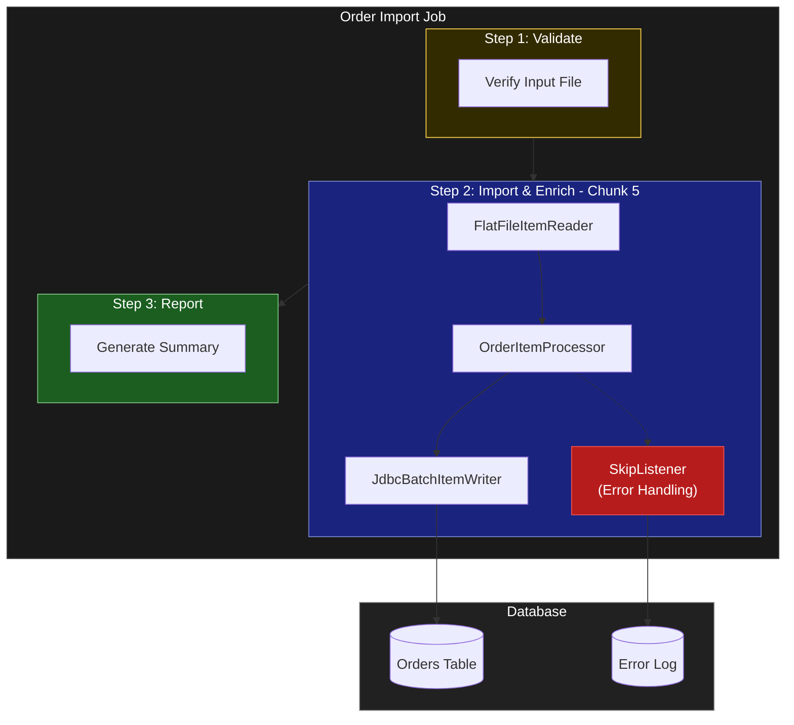

# Ultimate Spring Batch 6 Guide Sample Project

```mermaid
flowchart TD
    subgraph JOB [Order Import Job]
        direction TB

        subgraph STEP1 [Step 1: Validate]
            V1["Verify Input File"]
        end

        subgraph STEP2 [Step 2: Import & Enrich - Chunk 5]
            direction TB
            READER["FlatFileItemReader"]
            PROCESSOR["OrderItemProcessor"]
            WRITER["JdbcBatchItemWriter"]
            
            READER --> PROCESSOR --> WRITER
            
            SKIP["SkipListener\n(Error Handling)"]
            PROCESSOR -.-> SKIP
        end

        subgraph STEP3 [Step 3: Report]
            RP1["Generate Summary"]
        end

        STEP1 --> STEP2 --> STEP3
    end

    subgraph DB [Database]
        T1[("Orders Table")]
        T2[("Error Log")]
    end

    WRITER --> T1
    SKIP --> T2

    %% DARK THEME STYLING
    style JOB fill:#1a1a1a,stroke:#444,color:#fff
    style STEP1 fill:#332b00,stroke:#ffd54f,color:#fff
    style STEP2 fill:#1a237e,stroke:#7986cb,color:#fff
    style STEP3 fill:#1b5e20,stroke:#81c784,color:#fff
    style DB fill:#212121,stroke:#9e9e9e,color:#fff
    style SKIP fill:#b71c1c,stroke:#ef5350,color:#fff
```
