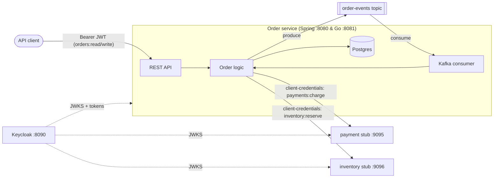

# Spring Boot vs. Go: the same production service, built twice

This project builds one non-trivial backend service **twice** — once as an
idiomatic **Spring Boot 4** application, once in **idiomatic Go** — so the two
can be compared feature-for-feature. It's the companion code for an article on
how the everyday building blocks of a Spring service translate to Go.

Both apps are the same order-processing service and are wired to the same
infrastructure. They even share a Kafka topic, so you can watch an order
created in one service get processed by the other.

- **`spring-app/`** — Spring Boot 4, Java 21, Gradle. The "everything and the
  kitchen sink" reference.
- **`go-app/`** — the Go twin, built on the standard library plus a handful of
  focused libraries. No web framework, no ORM.
- **`downstream-stub/`** — a small Go service standing in for two external
  APIs the order service calls with OAuth2. It validates the bearer tokens for
  real.
- **`keycloak/`** — a Keycloak realm import providing the OAuth2 authority.
- **[`GOLANG_REFERENCE.md`](./GOLANG_REFERENCE.md)** — the heart of the
  comparison: each Spring concern mapped to its Go implementation, with code.

## What each service does

Every feature below exists in **both** the Spring and Go apps:

| Concern | Feature |
|---|---|
| REST API | `POST/GET /api/orders` with JSON, path/query params |
| Validation | Request bodies validated, structured 400 responses |
| Error handling | RFC 9457 `application/problem+json` everywhere |
| Persistence | Postgres, one row per order |
| Migrations | Versioned schema migrations run at startup |
| Inbound security | OAuth2 resource server: validate Keycloak JWTs, enforce scopes per route |
| Outbound security | **Two** OAuth2 client-credentials targets (payment + inventory), each its own registration |
| Messaging | Kafka producer on order creation; consumer drives processing |
| Scheduled work | Background job counting unfinished orders |
| Configuration | Typed config with defaults |
| Observability | Health endpoints + Prometheus metrics |

## Architecture



**Order lifecycle:** `POST /api/orders` persists the order as `PENDING` and
publishes an `ORDER_CREATED` event. The consumer picks it up, flips it to
`PROCESSING`, calls the payment stub then the inventory stub (each with its own
OAuth2 token), and settles the order as `COMPLETED` or `FAILED`.

## Running it

**Prerequisites:** Docker + Docker Compose, a JDK 21, and Go 1.24+.

### 1. Start the infrastructure

```bash
docker compose up -d --build
```

This starts Postgres (two databases), Kafka, Keycloak (with the `demo` realm
imported), and the payment/inventory stub. Give Keycloak ~30s on first boot;
`docker compose ps` should show it healthy.

### 2. Run one or both apps

```bash
# Spring (port 8080)
cd spring-app && ./gradlew bootRun

# Go (port 8081) — in another terminal
cd go-app && go run .
```

Run them at the same time to see cross-service messaging: an order created in
one is visible on the shared Kafka topic and processed by whichever consumer
group reads it. (Each service has its own consumer group, so each gets its own
copy of every event; events for orders it doesn't own are safely ignored.)

### 3. Get a token and call the API

Everything is authenticated. Grab a client-credentials token for the
`orders-api-client` (it has both `orders:read` and `orders:write`):

```bash
export TOKEN=$(curl -s http://localhost:8090/realms/demo/protocol/openid-connect/token \
  -d grant_type=client_credentials \
  -d client_id=orders-api-client \
  -d client_secret=orders-api-client-secret | jq -r .access_token)
```

Create an order (against Spring on 8080, or Go on 8081):

```bash
ORDER_ID=$(curl -s -X POST http://localhost:8080/api/orders \
  -H "Authorization: Bearer $TOKEN" \
  -H 'Content-Type: application/json' \
  -d '{"customerEmail":"jane@example.com","item":"widget","quantity":2,"totalCents":1999}' | jq -r .id)
```

Fetch it back — within a second or two its `status` becomes `COMPLETED` with a
`paymentId`, proving the Kafka round-trip and both OAuth2 downstream calls ran:

```bash
curl -s http://localhost:8080/api/orders/$ORDER_ID -H "Authorization: Bearer $TOKEN" | jq
```

Try it **without** the token to see the `401`, or with a validation error
(`"quantity":0`) to see the `problem+json` `400`.

### 4. Observe

```bash
curl -s localhost:8080/actuator/prometheus | grep orders_pending   # Spring
curl -s localhost:8081/metrics            | grep orders_pending    # Go
```

Kafka UI is at <http://localhost:8085>; the Keycloak admin console is at
<http://localhost:8090> (`admin` / `admin`).

## The point

The two services are behaviorally identical. What differs is *how much is
framework and how much is your code* — and that difference is the whole
article. Read **[GOLANG_REFERENCE.md](./GOLANG_REFERENCE.md)** for the
side-by-side walkthrough.
