# Zero-Downtime Partition Swapping with Spring Boot 4 and PostgreSQL

A demo of a classic high-ingest pattern: **write to an index-light table, read from an
index-heavy table, and move data between them by swapping whole partitions** — with zero
downtime for both the producer and the consumer.

Every minute, the partition that just finished receiving writes is:

1. **Detached** from the hot ingest table with `DETACH PARTITION ... CONCURRENTLY`
2. **Indexed** offline, while it is a standalone table nobody is writing to
3. **Attached** to the read table as a metadata-only operation

The producer never stops inserting. The consumer never stops querying. No lock is ever
held that blocks either of them for more than a catalog update.

```mermaid
flowchart LR
    subgraph WRITE ["Write side (index-light)"]
        P["EventProducer\n(Spring Data JPA saveAll)"]
        EI[("events_ingest\nPARTITION BY RANGE (occurred_at)\nPK only")]
        P -->|"~125 inserts/s"| EI
    end

    subgraph SWAP ["PartitionSwapScheduler — every minute at :05"]
        D["1 DETACH PARTITION\nCONCURRENTLY"]
        I["2 CREATE INDEX ×2\n(offline, standalone table)"]
        A["3 ADD CHECK →\nATTACH PARTITION\n(metadata only)"]
        D --> I --> A
    end

    subgraph READ ["Read side (index-heavy)"]
        EV[("events\nPARTITION BY RANGE (occurred_at)\nPK + 2 partitioned indexes")]
        C["EventConsumer\n(Spring Data JPA queries\n+ EXPLAIN logging)"]
        EV --> C
    end

    EI -.->|"minute partition\nevents_pYYYYMMDD_HHMM"| D
    A -.->|"same physical table,\nnew parent"| EV

    style WRITE fill:#1a237e,stroke:#7986cb,color:#fff
    style SWAP fill:#332b00,stroke:#ffd54f,color:#fff
    style READ fill:#1b5e20,stroke:#81c784,color:#fff
```



## Why this pattern exists

Every secondary index on a hot table taxes every `INSERT`: more WAL, more buffer churn,
more random I/O maintaining B-tree pages that are being split at the write frontier.
The usual compromise is to under-index the table and let readers suffer, or index it
properly and let writers suffer.

Time-partitioning gives you a third option, because a minute (or hour, or day) that has
*ended* will never be written again. Data has two phases with different needs:

| Phase | Table | Indexes | Access pattern |
|---|---|---|---|
| Hot (current minute) | `events_ingest` | PK only | append-only inserts |
| Sealed (past minutes) | `events` | PK + `(event_type, occurred_at)` + `(occurred_at)` | analytical reads |

The swap moves a sealed minute from phase one to phase two. Crucially, **no rows are
copied** — `DETACH`/`ATTACH` are catalog operations on the same physical table. Indexing
happens in the gap between the two, when the table belongs to no parent and receives no
traffic, so index build cost is paid entirely off the hot path.

## The schema

All DDL is explicit SQL owned by `PartitionSchemaInitializer` (Hibernate schema
generation cannot express partitioned tables, so `ddl-auto: none`):

```sql
CREATE TABLE IF NOT EXISTS events_ingest (
    id          BIGINT GENERATED ALWAYS AS IDENTITY,
    occurred_at TIMESTAMPTZ NOT NULL DEFAULT now(),
    event_type  TEXT NOT NULL,
    payload     TEXT NOT NULL,
    PRIMARY KEY (id, occurred_at)
) PARTITION BY RANGE (occurred_at);

CREATE TABLE IF NOT EXISTS events (
    id          BIGINT NOT NULL,
    occurred_at TIMESTAMPTZ NOT NULL,
    event_type  TEXT NOT NULL,
    payload     TEXT NOT NULL,
    PRIMARY KEY (id, occurred_at)
) PARTITION BY RANGE (occurred_at);

-- Partitioned indexes on the READ parent only. ATTACH will link matching
-- child indexes to these instead of building anything under lock.
CREATE INDEX IF NOT EXISTS events_type_time_idx ON events (event_type, occurred_at);
CREATE INDEX IF NOT EXISTS events_time_idx     ON events (occurred_at);
```

Details worth noticing:

- **The PK is composite `(id, occurred_at)`.** PostgreSQL requires the partition key in
  every unique constraint on a partitioned table. `id` alone is still globally unique
  (one identity sequence feeds the whole partition tree), so the JPA entities map only
  `id` as `@Id`.
- **The two parents have identical row shape.** That is what makes a detached child of
  one attachable to the other.
- **Minute partitions are named `events_p20260805_1432`** — the name encodes the UTC
  lower bound, so the swap job recovers every partition's range from `pg_catalog` alone.
  No bookkeeping table, no state to drift.

## The swap, statement by statement

`PartitionSwapService` runs these for each completed minute (all logged at INFO, all in
autocommit — deliberately **not** `@Transactional`, see below):

```sql
-- 1. Seal: remove the minute from the ingest parent without blocking writers.
ALTER TABLE events_ingest DETACH PARTITION events_p20260805_1432 CONCURRENTLY;

-- 2. Index offline: the table is standalone now; nobody is blocked, nothing contends.
CREATE INDEX IF NOT EXISTS events_p20260805_1432_type_time_idx
    ON events_p20260805_1432 (event_type, occurred_at);
CREATE INDEX IF NOT EXISTS events_p20260805_1432_time_idx
    ON events_p20260805_1432 (occurred_at);

-- 3. Prove the range up front so ATTACH can skip its validation scan.
ALTER TABLE events_p20260805_1432 ADD CONSTRAINT events_p20260805_1432_bounds_check
    CHECK (occurred_at >= '2026-08-05 14:32:00Z' AND occurred_at < '2026-08-05 14:33:00Z');

-- 4. Publish: metadata-only, microseconds of SHARE UPDATE EXCLUSIVE on events.
ALTER TABLE events ATTACH PARTITION events_p20260805_1432
    FOR VALUES FROM ('2026-08-05 14:32:00Z') TO ('2026-08-05 14:33:00Z');

-- 5. The partition bounds now enforce the same range; the scaffold is redundant.
ALTER TABLE events_p20260805_1432 DROP CONSTRAINT events_p20260805_1432_bounds_check;
```

### Why every step is zero-downtime

| Step | Lock on live parent | Blocks producer? | Blocks consumer? |
|---|---|---|---|
| `DETACH ... CONCURRENTLY` | `SHARE UPDATE EXCLUSIVE` on `events_ingest` | No | No |
| `CREATE INDEX` (standalone table) | none on either parent | No | No |
| `ADD CONSTRAINT ... CHECK` (standalone table) | none on either parent | No | No |
| `ATTACH PARTITION` | `SHARE UPDATE EXCLUSIVE` on `events` (brief) | No | No |

Three PostgreSQL mechanics make the table above true, and they are the technical heart
of this demo:

1. **`DETACH PARTITION ... CONCURRENTLY` (PostgreSQL 14+)** runs as *two internal
   transactions*: the first marks the partition detach-pending and waits for in-flight
   snapshots to drain, the second finalizes the catalog change. Because it manages its
   own transactions, **it cannot run inside a transaction block** — which is exactly why
   `PartitionSwapService` uses plain autocommit `JdbcClient` calls and no
   `@Transactional`. Wrap it in a Spring transaction and PostgreSQL rejects it with
   `ALTER TABLE ... DETACH CONCURRENTLY cannot run inside a transaction block`.
   The non-concurrent variant would take `ACCESS EXCLUSIVE` on the parent and stall
   every insert — the exact downtime this pattern eliminates.

2. **Index builds happen on a detached table.** `CREATE INDEX` takes
   `SHARE` on the table it indexes — irrelevant, since after the detach nothing else
   touches that table. The index definitions exactly match the partitioned indexes on
   `events`, so the subsequent `ATTACH` merely *links* the existing child indexes to the
   parent indexes. Without the pre-build, `ATTACH` would build the missing indexes
   itself, inside its lock window.

3. **The scaffold `CHECK` constraint skips the validation scan.** `ATTACH PARTITION`
   must prove that every row falls inside the declared bounds. Absent other evidence, it
   scans the whole partition *while holding its locks*. If a `CHECK` constraint already
   implies the bounds, PostgreSQL trusts it and the attach is pure catalog metadata. We
   pay the proving scan in step 3 instead — on the standalone table, off the hot path —
   then drop the now-redundant constraint after the attach.

### Crash safety: every step resumable, every tick self-healing

The scheduler assumes it can die between any two statements and repairs on the next tick:

- **Died between DETACH's two internal transactions** → the child remains under
  `events_ingest` flagged `inhdetachpending` in `pg_inherits`. The next tick sees the
  flag and issues `ALTER TABLE events_ingest DETACH PARTITION ... FINALIZE`.
- **Died after detach, before attach** → a standalone `events_p*` table belongs to no
  parent. `adoptOrphans()` finds it (a `pg_class` row with no `pg_inherits` entry) and
  finishes indexing + attaching. `CREATE INDEX IF NOT EXISTS` and the
  `DROP CONSTRAINT IF EXISTS` / `ADD CONSTRAINT` pair make the resume idempotent.
- **Died after attach, before dropping the scaffold constraint** → a redundant but
  harmless `CHECK` remains; the partition is fully live.

Partition pre-creation runs every tick with `CREATE TABLE IF NOT EXISTS ... PARTITION OF
events_ingest`, keeping several minutes of headroom so row routing never races DDL.
A retention pass detaches (concurrently) and drops read partitions older than 30 minutes,
so the demo runs forever in constant space — dropping a partition is the same
zero-downtime trick in reverse.

## The Spring side

- **`EventProducer`** — `@Scheduled` batch inserts through `IngestEventRepository`
  (Spring Data JPA). It writes `occurred_at = now()` and never mentions partitions;
  PostgreSQL's tuple routing picks the right minute child.
- **`PartitionSwapScheduler`** — cron `5 * * * * *`: repair orphans, pre-create
  partitions, swap closed minutes, enforce retention. One bad tick logs and retries next
  minute.
- **`EventConsumer`** — reads through `ReadEventRepository` against the `events` mapping
  (`@Immutable` entity): a derived count, a native aggregation with explicit SQL, and a
  top-N. Every sixth run it logs `EXPLAIN (COSTS OFF)` for the window query so you can
  watch **partition pruning** select only the minutes inside the window and the
  post-hoc indexes get used.
- Two entities map the two tables: `IngestEvent` (mutable, insert path) and `ReadEvent`
  (`@Immutable`, query path). Same columns, different parents — same physical rows,
  before and after the swap.

## Running the demo

```bash
docker compose up -d       # PostgreSQL 16 on :5432
./gradlew bootRun
```

What to watch in the logs:

```text
INFO  ... EventProducer      : Producer has written 5000 events into events_ingest
INFO  ... PartitionSwapService : Swapping partition events_p20260805_1432 (7350 rows) out of events_ingest
INFO  ... PartitionSwapService : DDL: ALTER TABLE events_ingest DETACH PARTITION events_p20260805_1432 CONCURRENTLY
INFO  ... PartitionSwapService : DDL: CREATE INDEX IF NOT EXISTS events_p20260805_1432_type_time_idx ...
INFO  ... PartitionSwapService : DDL: ALTER TABLE events ATTACH PARTITION events_p20260805_1432 ...
INFO  ... PartitionSwapService : Partition events_p20260805_1432 indexed and attached to events in 41 ms
INFO  ... PartitionSwapScheduler : Swap tick done in 63 ms — swapped [events_p20260805_1432], adopted [], dropped []
INFO  ... EventConsumer      : Consumer: 36750 indexed events in the last PT5M — by type: ORDER_CREATED=9256, ...
```

The producer's counter never pauses across a swap tick — that is the demo working.

Poke at the internals while it runs:

```sql
-- watch partitions migrate between parents
SELECT p.relname AS parent, c.relname AS child, i.inhdetachpending
FROM pg_inherits i
JOIN pg_class c ON c.oid = i.inhrelid
JOIN pg_class p ON p.oid = i.inhparent
WHERE p.relname IN ('events_ingest', 'events')
ORDER BY parent, child;

-- prove the read path uses the swapped-in indexes and prunes partitions
EXPLAIN SELECT event_type, count(*) FROM events
WHERE occurred_at >= now() - interval '5 minutes' GROUP BY event_type;
```

## Tests

```bash
./gradlew test    # needs Docker: the integration test runs real PostgreSQL 16 via Testcontainers
```

`PartitionSwapIntegrationTest` drives the full lifecycle deterministically (demo
schedulers disabled): writes 100 events into last minute's partition through JPA,
invokes the swap, then asserts the partition changed parents, the rows are visible
through the read repository, the per-partition indexes exist in `pg_indexes`, and the
scaffold constraint is gone from `pg_constraint`. H2 is useless here — the whole subject
is PostgreSQL-native partition DDL — hence Testcontainers.

## Production notes

- **Minute-wide partitions are demo-sized.** Real systems use hourly/daily partitions;
  the mechanics are identical, only `PartitionNaming.WIDTH` and the cron change.
- **The grace window** (2s after minute close) covers in-flight commits; `DETACH
  CONCURRENTLY` additionally waits out any straggler snapshots on its own.
- **Identity + JPA batching:** `GenerationType.IDENTITY` disables Hibernate JDBC
  batching. Fine for a demo; a high-throughput ingest path would pre-allocate from the
  sequence or drop to `JdbcTemplate.batchUpdate`.
- **One swap driver at a time.** Multiple app instances would race the DDL; in a
  clustered deployment, put the swap tick behind a leader election or
  ShedLock-style lease. The producer and consumer scale out freely.
- **A default partition would break this** — `DETACH ... CONCURRENTLY` refuses to run if
  the parent has a `DEFAULT` partition. Pre-creating minute partitions ahead of time is
  the alternative, and the scheduler keeps 3 minutes of headroom.
